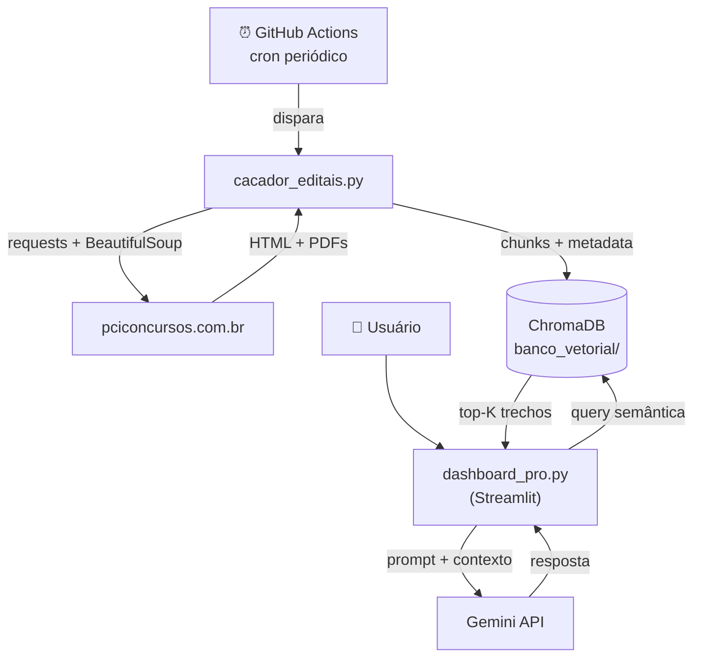

# 🏛️ Oráculo de Editais

> Pipeline analítico/RAG para coleta, estruturação e consulta de editais públicos, com versão inicial focada em concursos públicos nacionais e de Minas Gerais.


---

## 📸 Demo

> A demonstração visual do dashboard será adicionada após a captura do ambiente em execução.

---

## 📌 O problema

Editais públicos no Brasil sofrem de **fragmentação informacional**:

- Os documentos vivem em PDFs longos, com formatação irregular e linguagem jurídica densa
- Cada órgão publica em portal próprio, sem padronização entre fontes
- Comparar oportunidades (salário, datas, requisitos, abrangência) exige horas de leitura manual
- Retificações e prorrogações são frequentes e nem sempre comunicadas ativamente

A consequência é tempo perdido em leitura e oportunidades perdidas por desatenção.

---

## 🎯 O que o projeto faz

| Capacidade | Descrição |
|---|---|
| **Coleta automatizada** | Crawler varre `pciconcursos.com.br` periodicamente (cron via GitHub Actions) |
| **Indexação vetorial** | PDFs são fatiados em chunks, transformados em embeddings e gravados em ChromaDB |
| **Raio-X de edital** | A partir de um edital selecionado, o LLM gera resumo estruturado (cargos, vagas, salário, datas, escolaridade) |
| **Consulta em linguagem natural (RAG)** | Perguntas em português retornam respostas geradas a partir dos trechos recuperados na base |
| **BI salarial** | Comparativo Nacional × MG, ranking dos maiores salários, exportação CSV |
| **Filtros operacionais** | Busca por órgão/cargo, slider de salário mínimo, separação por região |

---

## ✅ Status do projeto

**O que já funciona:**
- [x] Coleta automatizada de editais (Nacionais + Minas Gerais)
- [x] Extração de texto de PDFs textuais via `pypdf`
- [x] Indexação vetorial em ChromaDB local
- [x] Dashboard Streamlit com BI salarial e Raio-X por edital
- [x] Chat com RAG sobre os editais indexados
- [x] Agendamento periódico via GitHub Actions

**O que está planejado:**
- [ ] Extração estruturada completa de campos (datas de inscrição, vagas, órgão, escolaridade)
- [ ] Persistência do banco vetorial fora do repositório
- [ ] Score de aderência por perfil de candidato
- [ ] Deploy público (Streamlit Cloud)
- [ ] OCR para PDFs digitalizados
- [ ] Testes automatizados (parser HTML, ingestão)
- [ ] Logging estruturado e observabilidade básica

---

## 📈 Valor analítico

O projeto foi pensado para apoiar decisão e reduzir custo de leitura. A base atual já permite:

- **Identificar oportunidades** por cargo, órgão, faixa salarial e região
- **Comparar remunerações** entre editais nacionais e do recorte regional
- **Reduzir tempo de leitura** de PDFs extensos por meio de resumo gerado por LLM
- **Consultar documentos longos em linguagem natural**, com a resposta ancorada em trechos rastreáveis da base
- **Apoiar priorização** de oportunidades segundo critérios objetivos (salário, abrangência, palavra-chave)

A intenção, em fases seguintes, é evoluir para um produto analítico que também sirva a editais de fomento, inovação e oportunidades privadas.

---

## 🏗️ Arquitetura



**Fluxo em uma linha:** crawler → chunking → embeddings → ChromaDB → retrieval → prompt → Gemini → UI.

---

## 🛠️ Stack

| Camada | Ferramenta | Por quê |
|---|---|---|
| Coleta web | `requests` + `beautifulsoup4` | Padrão para HTML estático; volume atual dispensa Scrapy |
| Extração de PDF | `pypdf` | Suficiente para PDFs textuais; OCR fica como evolução |
| Vetorização e busca | `chromadb` | Persistência local sem servidor; embeddings default integrados |
| LLM | `google-generativeai` (Gemini) | Bom equilíbrio entre custo, velocidade e qualidade para sumarização e consulta de textos longos |
| Interface | `streamlit` | Permite construir um produto analítico em Python puro com curva curta |
| Agendamento | GitHub Actions | Cron sem infraestrutura própria, alinhado ao versionamento |

---

## 📋 Principais campos extraídos

Dicionário de dados atual (o que de fato é gerado e indexado pelo crawler):

| Campo | Tipo | Origem | Descrição |
|---|---|---|---|
| `titulo` | `string` | parser HTML + normalização | Nome do edital, derivado do link âncora no portal |
| `abrangencia` | `enum` (`Nacional`, `Minas Gerais`) | URL de origem do scraping | Recorte regional do edital |
| `salario` | `float` (BRL) | regex sobre o cartão HTML | Maior valor monetário detectado no resumo do anúncio |
| `documento` | `string` | chunk textual do PDF | Trecho do edital após divisão por parágrafos |
| `id` | `string` (`aranha_N`) | gerado em runtime | Identificador único do chunk dentro do ChromaDB |

> Campos como **órgão**, **datas de inscrição**, **número de vagas**, **escolaridade exigida**, **link direto do PDF** e **data de coleta** ainda **não** são persistidos. Estão listados em *Próximos passos* como evolução prioritária do schema.

---

## ▶️ Como rodar localmente

### 1. Pré-requisitos
- Python 3.10+
- Chave da API Gemini (gratuita em https://aistudio.google.com/apikey)

### 2. Setup

```bash
git clone https://github.com/<seu-usuario>/oraculo-rag.git
cd oraculo-rag

python -m venv venv
# Windows:
venv\Scripts\activate
# Linux/Mac:
source venv/bin/activate

pip install -r requirements.txt
```

### 3. Configurar a chave da API

```bash
mkdir -p .streamlit
cp .streamlit/secrets.toml.example .streamlit/secrets.toml
# Edite .streamlit/secrets.toml e cole sua chave Gemini
```

### 4. Popular o banco vetorial (primeira execução)

```bash
python src/oraculo/crawler.py
# ou, com Make:
make crawl
```

Cria a pasta `banco_vetorial/` e povoa com os editais do momento. **Demora alguns minutos** (download dos PDFs + geração de embeddings).

### 5. Rodar o dashboard

```bash
streamlit run app/dashboard.py
# ou, com Make:
make app
```

Abre em `http://localhost:8501`.

> Para listar todos os comandos disponíveis no Makefile: `make help`.

---

## 🤖 Agendamento automático

O workflow [`.github/workflows/robo_cacador.yml`](.github/workflows/robo_cacador.yml) executa o crawler periodicamente (cron `0 0 */2 * *`). Para acionamento manual, basta ir em **Actions → 🕷️ Robô Caçador de Editais → Run workflow**.

> ℹ️ A execução agendada precisa de uma camada de persistência externa para reter os dados entre rodadas. A configuração atual roda o crawler no runner, mas a persistência do banco vetorial fora do repositório está nos *Próximos passos*.

---

## 📁 Estrutura do projeto

```
oraculo-rag/
├── .github/workflows/
│   └── robo_cacador.yml          # Cron do crawler
├── .streamlit/
│   └── secrets.toml.example      # Template de secrets (real fica gitignored)
├── src/oraculo/
│   ├── __init__.py
│   └── crawler.py                # Crawler + ingestão vetorial
├── app/
│   └── dashboard.py              # Aplicação Streamlit (3 abas)
├── docs/
│   └── dicionario_dados.md       # Schema dos campos persistidos
├── tests/                        # Testes automatizados (a popular)
├── outputs/prints/               # Capturas do dashboard (a popular)
├── Makefile                      # Atalhos: install, crawl, app, clean
├── requirements.txt              # Dependências pinadas
├── .gitignore                    # venv, banco_vetorial, .env, *.pdf
├── .env.example                  # Alternativa ao secrets.toml
├── LICENSE                       # MIT
└── README.md
```

Pastas geradas em runtime (não versionadas):
- `banco_vetorial/` — ChromaDB persistente local (~44 MB após primeira execução)
- `venv/` — ambiente virtual Python

---

## 🧠 Decisões técnicas

**Por que regex para extração de salário em vez de LLM?**
A expressão regular (`r'r\$\s*([\d\.]+,\d{2})'`) é determinística, gratuita e suficiente para a maior parte dos editais cujo cartão de listagem expõe valores monetários. O uso do LLM fica concentrado nas tarefas em que a flexibilidade compensa o custo: resumo estruturado e resposta a perguntas livres.

**Por que ChromaDB e não Pinecone/Weaviate?**
ChromaDB roda localmente, sem servidor próprio nem credenciais externas, e oferece embeddings default integrados. Para o volume atual da base, atende bem como ponto de partida. A migração para uma camada vetorial gerenciada está prevista nos *Próximos passos*.

**Por que Gemini?**
Gemini foi escolhido por oferecer bom equilíbrio entre custo, velocidade e qualidade para sumarização e consulta de textos longos, com quota inicial adequada à fase atual do projeto.

**Por que Streamlit e não FastAPI ou Power BI?**
Streamlit permite construir um produto analítico em Python puro, com deploy simples no Streamlit Cloud. FastAPI seria adequado se houvesse um cliente externo consumindo uma API, o que ainda não é o caso. Power BI separaria dado de código e reduziria o valor do projeto enquanto peça de portfólio técnico.

**Por que filtrar estados manualmente em vez de uma rota dedicada?**
A página da região Sudeste do portal mistura SP, RJ, ES, MG e PR. A lista de prefixos é um filtro pragmático que remove ruído sem depender de mudanças na estrutura HTML do portal de origem.

---

## 📊 Exemplo de uso

### Pergunta no chat
> *"Existe alguma vaga para Engenheiro Civil em Minas Gerais com salário acima de R$ 8.000?"*

### Como o sistema responde
1. Busca semântica no ChromaDB recupera os trechos mais relevantes para a pergunta
2. Os trechos compõem o contexto do prompt enviado ao Gemini
3. A instrução do prompt orienta o modelo a responder com base apenas nos trechos recuperados, reduzindo o risco de alucinação
4. A interface mostra a resposta gerada e, em um expander, os trechos da base que sustentam a saída

### Raio-X de um edital
A partir do edital selecionado na sidebar, o LLM lê o conteúdo indexado e devolve um resumo em Markdown com:
- Resumo da oportunidade
- Cargos e vagas principais
- Remuneração e benefícios
- Datas importantes
- Requisitos de escolaridade

Quando uma informação não consta no documento, o modelo é orientado a registrar explicitamente *"Não especificado no documento"*.

---

## ⚠️ Limitações conhecidas

- **PDFs digitalizados não são lidos**: o `pypdf` não realiza OCR. Editais escaneados ficam invisíveis para o pipeline atual.
- **Cobertura da regex de salário**: cobre apenas valores no formato `R$ X.XXX,XX` presentes no cartão de listagem. Salários expressos em texto livre (ex.: *"vencimento de cinco mil reais"*) não são capturados.
- **Truncagem de contexto no Raio-X**: o conteúdo enviado ao LLM é limitado a 60.000 caracteres por edital. Editais muito extensos perdem parte do contexto. A migração para retrieval por similaridade dentro do edital (em vez de carregamento integral) está prevista.
- **Seleção do modelo Gemini**: o código atual itera os modelos disponíveis e usa o primeiro elegível. Em produção, fixar uma versão específica (ex.: `gemini-1.5-flash`) é mais previsível.
- **Persistência do banco vetorial**: o ChromaDB local é adequado para desenvolvimento, mas não é ideal para produção nem para preservar a base entre execuções automatizadas.
- **Recorte regional**: o crawler está focado em *Nacional + Minas Gerais*. Expandir para outros estados é viável, mas exige re-tunar os filtros.

---

## 🚧 Próximos passos

- [ ] Reorganizar o repositório em `src/oraculo/` + `app/` + `docs/` + `tests/`
- [ ] Definir schema de edital com `pydantic` e persistir campos estruturados (datas, vagas, órgão, escolaridade)
- [ ] Aplicar extração estruturada via LLM **antes** do chunking, destravando BI multidimensional
- [ ] Substituir `split("\n\n")` por `RecursiveCharacterTextSplitter`
- [ ] Score de aderência por perfil de candidato (similaridade de embeddings)
- [ ] Alerta D-3 antes do encerramento das inscrições (e-mail/Telegram)
- [ ] OCR para PDFs digitalizados (`pytesseract`)
- [ ] Migrar o banco vetorial para uma solução gerenciada (Chroma Cloud, Qdrant ou similar)
- [ ] Logging estruturado (`logging` em vez de `print`)
- [ ] Smoke test do parser HTML (`pytest` + `responses`)
- [ ] `pre-commit` com `ruff` + `detect-secrets`

---

## 📄 Licença

MIT — veja [LICENSE](LICENSE).

---

## 🤝 Contato

Projeto desenvolvido como peça de portfólio na área de dados. Sugestões e contribuições são bem-vindas via Issues.
